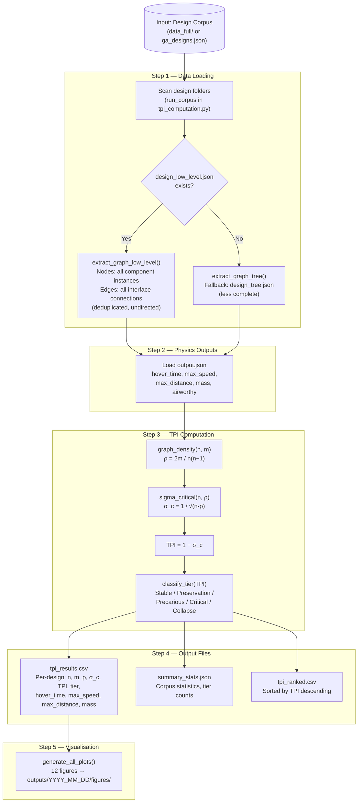

# TPI Analysis — Topological Precariousness Index for UAV Design Corpora

**Authors:** Roshi Rose Nilchiani, PhD & Rashika Sugganahalli Natesh Babu  
**Affiliation:** Stevens Institute of Technology  
**Framework:** Architectural Precariousness Measure An Equivalent of Tipping Point for the Design Phase in Cyber-Physical
Systems and Platforms

---

## Overview

This repository computes the **Topological Precariousness Index (TPI)** across large UAV design corpora. TPI quantifies how close a system's coupling topology is to the May–Wigner tipping point, the threshold at which random perturbations in inter-component coupling strengths cause systemic instability.

The pipeline has been validated on two datasets:
- **AircraftVerse** (27,714 designs, SRI/DARPA TRADES)
- **SRI GA-Optimised Designs** (17,387 designs, TRADES genetic algorithm)

---

## Mathematical Foundation

### Graph Representation

Each UAV design is modelled as an undirected graph G = (V, E):
- **Node** n = number of physical components (fuselage, hub, arms, motors, propellers, sensors, flanges, ...)
- **Edge** m = number of interface connections (structural, power, data)

### Core Equations

**Graph density (connectance):**

```
ρ = 2m / [n(n − 1)]
```

**May–Wigner critical coupling strength:**

```
σ_critical = 1 / √(n · ρ)
```

The May–Wigner stability criterion states that a complex system with n components, connection probability ρ, and mean coupling strength σ is stable if and only if:

```
σ · √(n · ρ)  <  1
```

**Topological Precariousness Index:**

```
TPI = 1 − σ_critical = 1 − 1/√(n · ρ)
```

TPI ∈ [0, 1):
- **TPI → 0**: maximum structural slack; system is far from the tipping point
- **TPI → 1**: system is at or past the tipping point (collapse regime)

**May–Wigner verification (internal check):**

```
σ_critical · √(n · ρ)  =  1.0   (always, by construction)
```

### Fragility Tier Classification

| Tier | TPI Range | Interpretation |
|---|---|---|
| Stable | TPI ≤ 0 | Synergistic; σ_critical > 1 — cannot be tipped |
| Preservation | 0 < TPI ≤ 0.30 | Low precariousness; structural slack preserved |
| Precarious | 0.30 < TPI ≤ 0.70 | Moderate; coupling perturbations can destabilise |
| Critical | 0.70 < TPI ≤ 0.90 | High; near the tipping point boundary |
| Collapse | TPI > 0.90 | At or past the tipping threshold |

### Special Case: Tree Topologies

For any strict tree graph (m = n − 1):

```
ρ = 2(n−1) / [n(n−1)] = 2/n
n · ρ = 2.000   (exact, size-invariant)
TPI = 1 − 1/√2 ≈ 0.2929   (constant)
```

All SRI GA-optimised designs are strict trees → constant TPI = 0.2929 (Preservation tier).

---

## Pipeline Flowchart



---

## Repository Structure

```
TPI_Analysis/
├── README.md                        ← this file
├── .gitignore
├── config.py                        ← all paths and parameters (set DATA_DIR here)
├── main.py                          ← pipeline entry point
├── requirements.txt
│
├── src/                             ← core library (do not modify)
│   ├── graph_extraction.py          ← parse design JSON → coupling graph
│   ├── tpi_computation.py           ← TPI equations, batch processing
│   ├── utils.py                     ← I/O, logging, CSV/JSON helpers
│   └── visualization.py             ← all 12 plot generators
│
├── experiments/                     ← sample experiment packages
│   ├── aircraftverse/               ← AircraftVerse: 27,714 UAV designs
│   │   ├── README.md                ← dataset description, run instructions
│   │   └── sample_outputs/
│   │       ├── figures/             ← R01–R09 final verified figures
│   │       └── data/
│   │           └── tpi_verified.csv ← ground-truth TPI for all 27,714 designs
│   │
│   └── sri_new_designs/             ← SRI GA-optimised: 17,387 UAV designs
│       ├── README.md                ← dataset description, run instructions
│       ├── sri_tpi_experiment.py    ← standalone analysis script
│       └── sample_outputs/
│           ├── figures/             ← S1–S9 + CAD + diagnostic plots
│           └── data/
│               ├── sri_tpi_results.csv
│               └── sri_summary_stats.csv
│
├── docs/
│   └── EQUATIONS.md                 ← full equation derivations and verification
│
│
└── outputs/                         ← generated at runtime (gitignored if large)
    └── archive/                     ← historical experiment runs
```

---

## Quick Start

### 1. Install dependencies

```bash
pip install -r requirements.txt
```

Dependencies: `numpy>=1.24`, `matplotlib>=3.7`

### 2. Set your data path

Edit `config.py`:
```python
DATA_DIR = "/path/to/AircraftVerse/data_full"
```

Or use the CLI flag (no config edit needed):
```bash
python main.py --data-dir /path/to/data_full
```

### 3. Run

```bash
# Full corpus
python main.py

# Quick test (first 500 designs)
python main.py --max 500

# Plots only from an existing CSV
python main.py --from-csv --plots-only

# SRI GA designs (standalone script)
python experiments/sri_new_designs/sri_tpi_experiment.py
```

### 4. Using a different dataset

The pipeline is dataset-agnostic for any corpus structured as AircraftVerse:
- One subfolder per design
- Each subfolder contains `design_low_level.json` (preferred) or `design_tree.json`
- Optional `output.json` for physics/performance data

Just point `--data-dir` at your root folder. The pipeline discovers all subdirectories automatically.

---

## Input Data Formats

### AircraftVerse (`data_full/`)

**Source:** https://zenodo.org/record/6525446

```
data_full/
├── design_1/
│   ├── design_low_level.json   ← PRIMARY: all components + connections
│   ├── design_tree.json        ← FALLBACK: high-level hierarchy only
│   └── output.json             ← physics outputs
```

**design_low_level.json:**
```json
{
  "components": [
    {"component_instance": "Arm_1", "component_type": "Tube"},
    {"component_instance": "Motor_1", "component_type": "Motor"},
    ...
  ],
  "connections": [
    {"from_ci": "Hub_1", "from_conn": "Port1", "to_ci": "Flange_1", "to_conn": "Top"},
    ...
  ]
}
```
Nodes = len(components). Edges = unique undirected pairs in connections (both directions listed; deduplicated).

**output.json:**
```json
{
  "Hover_Time": 412.3,
  "Max_Speed": 18.5,
  "Max_Distance": 7640.0,
  "Mass": 2.14
}
```

### SRI GA Designs (`ga_designs.json`)

```json
[
  {
    "target_metrics": {"hover_time": ..., "max_speed": ..., "max_distance": ...},
    "designs": [
      {
        "name": "design_<id>",
        "hub": {"node_type": "ConnectedHub6_Sym", "mainSegment": {...}},
        "fuselageWithComponents": {"node_type": "SingleBatteryFuselageWithComponents", ...}
      }
    ]
  }
]
```

---

## Output Files

### `tpi_results.csv`

One row per design.

| Column | Type | Description |
|---|---|---|
| `design` | str | Design folder name (e.g. `design_1`) |
| `source` | str | `low_level` or `tree` (graph extraction method) |
| `n_nodes` | int | Number of components (graph nodes) |
| `m_edges` | int | Number of interface connections (graph edges) |
| `m_struct` | int | Structural edges (= m_edges for low_level source) |
| `m_func` | int | Functional inferred edges (0 for low_level source) |
| `rho` | float | Graph density ρ = 2m/[n(n−1)] |
| `sigma_critical` | float | May–Wigner threshold σ_c = 1/√(n·ρ) |
| `tpi` | float | Topological Precariousness Index = 1 − σ_c |
| `tier` | str | Fragility tier (stable/preservation/precarious/critical/collapse) |
| `hover_time` | float | Hover endurance (seconds); null if not airworthy |
| `max_speed` | float | Maximum forward speed (m/s); null if not airworthy |
| `max_distance` | float | Maximum range (m); null if not airworthy |
| `mass` | float | Total mass (kg) |
| `airworthy` | int | 1 = valid physics output; 0 = physics failure; null = no output.json |

### `summary_stats.json`

```json
{
  "total_designs": 27714,
  "flagged_for_review": 0,
  "tpi_stats": {
    "min": 0.2991, "max": 0.3531, "mean": 0.3339, "std": 0.0099
  },
  "tier_counts": {
    "stable": 0, "preservation": 0, "precarious": 27714, "critical": 0, "collapse": 0
  }
}
```

### `tpi_ranked.csv`

Same columns as `tpi_results.csv`, sorted by TPI descending (most precarious first).

---

## Output Figures

All figures are saved to `outputs/YYYY_MM_DD/figures/` when running `main.py`.  
Pre-computed figures from each validated experiment are in `experiments/*/sample_outputs/figures/`.

| Figure | Description |
|---|---|
| `fig_01_tpi_distribution.png` | TPI histogram across full corpus |
| `fig_02_tpi_cdf.png` | Cumulative distribution of TPI |
| `fig_03_phase_space_may_wigner.png` | (n, ρ) phase space with May–Wigner boundary |
| `fig_04_tpi_vs_nodes.png` | TPI vs component count n |
| `fig_05_tpi_vs_density.png` | TPI vs graph density ρ |
| `fig_06_tpi_vs_hover_time.png` | TPI vs hover time (airworthy only) |
| `fig_07_tpi_vs_max_speed.png` | TPI vs max speed (airworthy only) |
| `fig_08_tpi_vs_max_distance.png` | TPI vs max range (airworthy only) |
| `fig_09_quadrant_discriminator.png` | Four-quadrant TPI × performance split |
| `fig_10_tpi_airworthy_comparison.png` | TPI distribution: airworthy vs non-airworthy |
| `fig_11_tier_breakdown.png` | Bar chart: design count per fragility tier |
| `fig_12_correlation_heatmap.png` | Pearson correlation: TPI, n, ρ, performance |

**Refined figures (R01–R09)** from the AircraftVerse experiment:

| Figure | Description |
|---|---|
| `R01_design_space_rho_vs_n.png` | (n, ρ) scatter with May–Wigner boundary and corpus band |
| `R02_sigma_rho_tpi_n.png` | σ_c vs ρ (left) and TPI vs n (right) — dual panel |
| `R02a_tpi_vs_graph_density.png` | TPI vs ρ split panel |
| `R02b_tpi_vs_component_count.png` | TPI vs n |
| `R03_tpi_density_distribution.png` | KDE of TPI with tier boundaries |
| `R04_quadrant_hover_time.png` | Quadrant: hover time vs TPI |
| `R05_quadrant_max_distance.png` | Quadrant: max distance vs TPI |
| `R06_quadrant_max_speed.png` | Quadrant: max speed vs TPI |
| `R07_tpi_vs_composite_performance.png` | Composite performance P vs TPI |
| `R08_pareto_frontier.png` | Pareto front: (minimise TPI, maximise P) |
| `R09_design_density_vs_rho.png` | Marginal distribution of ρ |

---

## Corpus Comparison

| Metric | AircraftVerse | SRI GA Designs |
|---|---|---|
| Designs | 27,714 | 17,387 |
| n (components) | 21 – 265 | 9 – 22 (6 discrete values) |
| ρ (graph density) | 0.008 – 0.115 | 2/n per design |
| n·ρ | 2.036 – 2.390 (mean 2.29) | 2.000 (exact constant) |
| TPI range | 0.2991 – 0.3531 | 0.2929 (constant) |
| Fragility tier | 100% Precarious | 100% Preservation |
| Topology type | Near-tree (cross-connections present) | Strict tree (m = n−1 always) |
| Airworthy | 27.8% (7,690 / 27,714) | 100% (17,387 / 17,387) |
| Graph source | design_low_level.json | ga_designs.json (hierarchical JSON) |

---

## References

- Nilchiani, R. R. & Sugganahalli N B, R. (2026). Architectural Precariousness Measure An Equivalent of Tipping Point for the Design Phase in Cyber-Physical Systems and Platforms. Stevens Institute of Technology.
- AircraftVerse corpus: https://zenodo.org/record/6525446
- SRI TRADES framework: https://github.com/SRI-CSL/AircraftVerse
- May, R. M. (1972). Will a Large Complex System Be Stable? *Nature*, 238, 413–414.

---

## Citation

If you use this code or findings, please cite:

```
Nilchiani, R. R. & Sugganahalli N B, R. (2026).
Architectural Precariousness Measure An Equivalent of Tipping Point for the Design Phase in Cyber-Physical Systems and Platforms. Stevens Institute of Technology.
```
